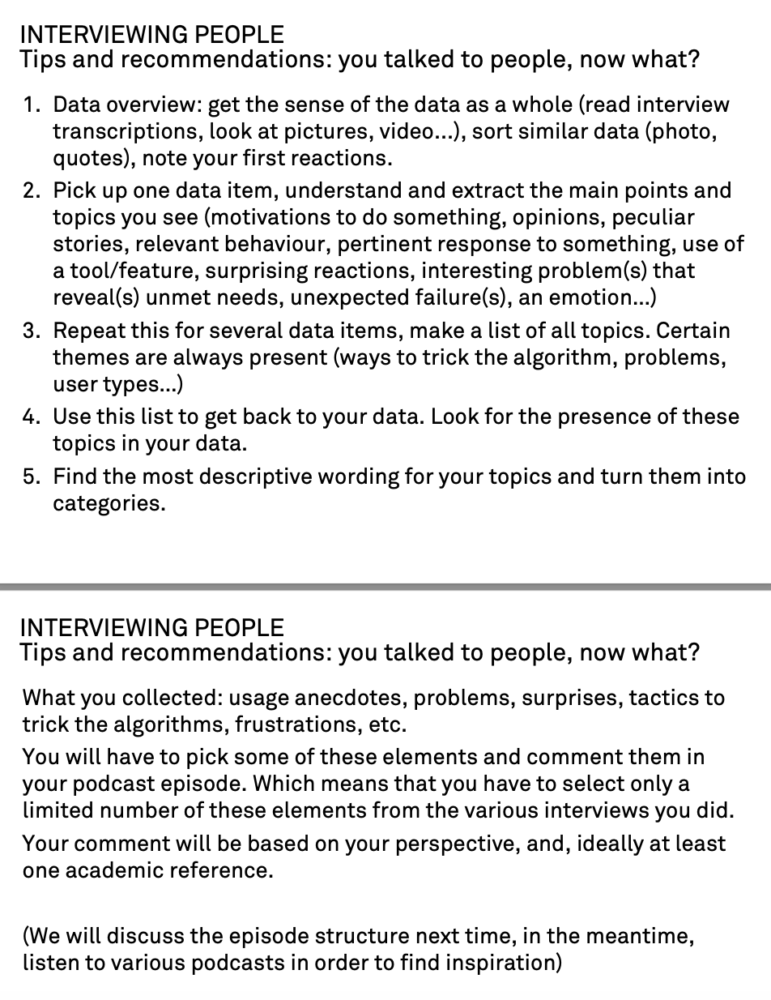

# md research seminar

## 1104

ethnographic research - ethnography

research project: how users of digital technologies interpret one specific algorithm

3 users, 4-5 audio podcast

bubble sort
information theory - whether a machine can think?
algorithm as an everyday notion: 

- ordering/filtering
- social negativation
- suggestions based on traces
- talking to machine
- text-to-image generators

Readings recommended (in zotero):
- Nick Seaver: Algorithms as culture: Some tactics for the ethnography of algorithmic systems
- Folk theories of algorithmic recommendations on Spotify: Enacting data assemblages in the global South Ignacio Siles1 , Andr es Segura-Castillo2, Ricardo Solı s3 and M onica Sancho3
    - consider more methods other than interview, let them draw or something,,
    - analyse the interviews 
    - study the folk theories of the algorithms you selected
- [link](https://www.dropbox.com/s/gj68k3tbt3q6p14/Archive.zip?e=1&dl=0) to a list of resources

Project Brief:

Chinese version: 算法解读项目简介

社交媒体发布顺序、类似Dall-E的文本生成图像工具、Spotify歌曲推荐、与Siri或Alexa的互动、自动门开启、火车座位分配……所有这些互动都由算法来调控。有些算法相当复杂，依赖于机器学习技术，而另一些则相对简单。然而，这些算法在我们日常生活中的作用越来越大。我们如何研究它们？我们如何调查它们的存在？它们对我们的社交生活有何影响？

Method：在这个个人项目中，每个人将选择一个service，使用访谈方法来调查人们如何使用、反应、（尝试）理解或“欺骗”它。更具体地说，你将关注人们如何对这些算法形成/建立假设，他们如何认为算法运行的方式，以及他们如何“测试”它们并从中学到什么。

截至12月17日，准备一个5分钟的播客节目和一个10分钟的演示，描述你的发现（你研究的技术、方法，以及你从中得出的主要结论）。

## 1105
interviewing people: planning ur research
- question: define your research perimeter + question YOU are interested in
- who are you interested in? where to go, and from whom, the material can be obtained?
- interview guides: a list of 5-7 topics you will talk about with your interlocutors. An interview guide is not a questionnaire, it's a set of themes to guide your discussion

method: sampling
| Type of sampling | Main usage in design |
|---|------|
| Random (pick-up participants randomly)| Get a representative sample of the population|
|Homogeneous (select participants that corresponds to the same criteria) | Provide better focus and safer conclusions |
|Maximal variation (select highly different participants according to one or more criteria) | Give better scope to the research results |
|Based on your theory (depends on your questions, hypotheses)|Test an hypothesis, test your design questions|
|Extreme cases (pick-up only weird and deviant cases)|Test the boundaries of a model or seek new possibilities|
|According to reputation (choose participant based on recommendation by experts)|Explore more deeply|

method: contact + rapport
method: talking to people
