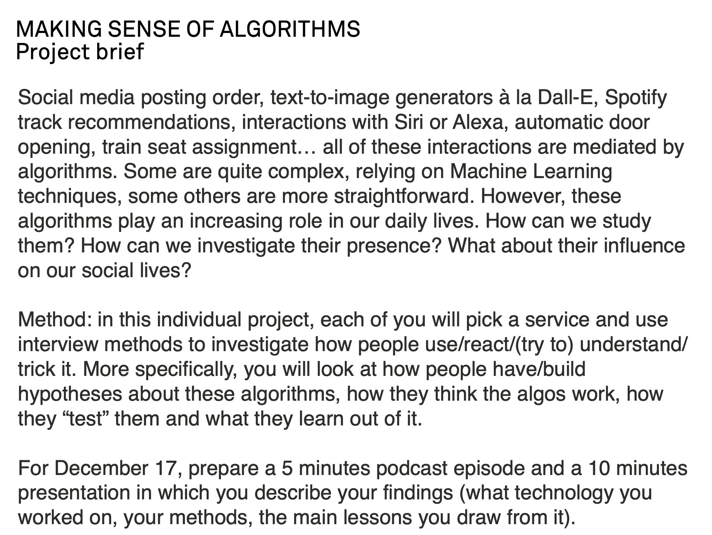
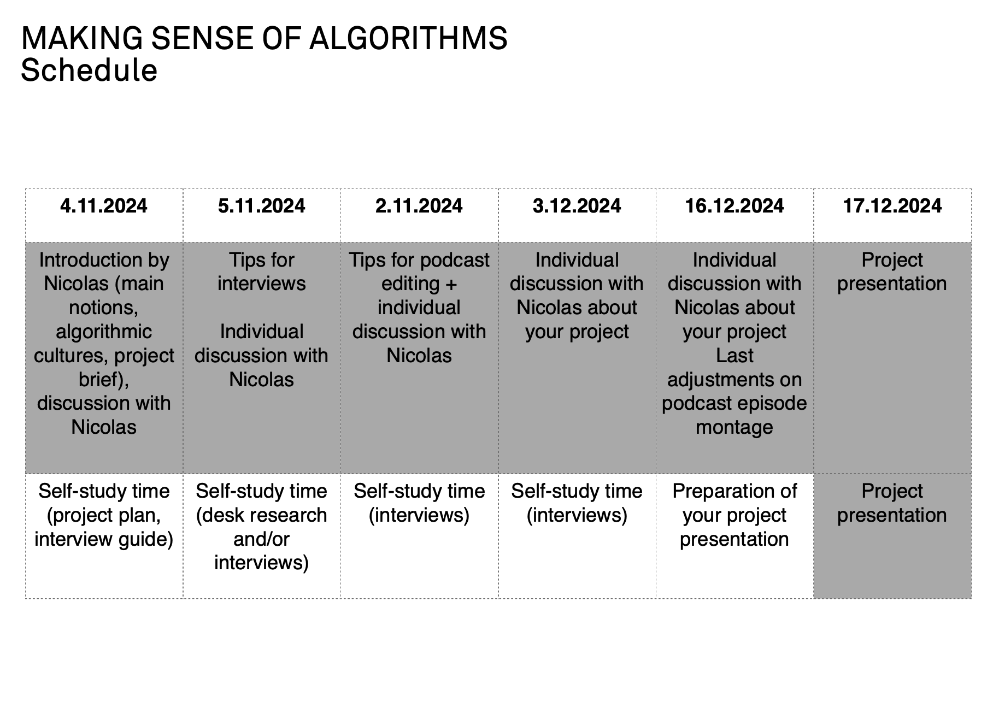

# md research seminar

## 1104

ethnographic research - ethnography

research project: how users of digital technologies interpret one specific algorithm

3 users, 4-5 audio podcast

bubble sort
information theory - whether a machine can think?
algorithm as an everyday notion: 

- ordering/filtering
- social negativation
- suggestions based on traces
- talking to machine
- text-to-image generators

Readings recommended (in zotero):
- Nick Seaver: Algorithms as culture: Some tactics for the ethnography of algorithmic systems
- Folk theories of algorithmic recommendations on Spotify: Enacting data assemblages in the global South Ignacio Siles1 , Andr es Segura-Castillo2, Ricardo Solı s3 and M onica Sancho3
    - consider more methods other than interview, let them draw or something,,
    - analyse the interviews 
    - study the folk theories of the algorithms you selected

Project Brief:

Chinese version: 算法解读项目简介

社交媒体发布顺序、类似Dall-E的文本生成图像工具、Spotify歌曲推荐、与Siri或Alexa的互动、自动门开启、火车座位分配……所有这些互动都由算法来调控。有些算法相当复杂，依赖于机器学习技术，而另一些则相对简单。然而，这些算法在我们日常生活中的作用越来越大。我们如何研究它们？我们如何调查它们的存在？它们对我们的社交生活有何影响？

方法：在这个个人项目中，每个人将选择一个服务，使用访谈方法来调查人们如何使用、反应、（尝试）理解或“欺骗”它。更具体地说，你将关注人们如何对这些算法形成/建立假设，他们如何认为算法运行的方式，以及他们如何“测试”它们并从中学到什么。

截至12月17日，准备一个5分钟的播客节目和一个10分钟的演示，描述你的发现（你研究的技术、方法，以及你从中得出的主要结论）。

# Project HERE

## brainstorming of algos

- algo 1: steam: store recommendations, sales/discounts during festivals; ads
- algo 2: the RED, the recommendations according to what people around you are searching, is it keeping monitoring? why the simplist or most recognized algorithm is assuming that people who is under the same wifi signal with you (or geographically around you) like is what you might like? and the contact like? how the percent of ads in the recommendations are defined or growing?
- **algo 3: Taobao ~~/Alibaba~~ (e-commerce):**
    - **the pop-up windows added to all other softwares, people are getting annoying but they entertained this so how we praise or criticize the promotion? are the pop-up ads all the same in different apps or has algorithm inside? according to what, the user or the platform? each time when the other software opens, the ads would refresh and pop-up a new one, is there algorithm inside?**
    - search pages algorithm,
    - filterings, the re-ranking according to different
    - main page recommendations,
    - popularity and trending analysis
- algo 4: matchmaking in online co-op games

## A reserach question?
How do users perceive and respond to algorithm-driven pop-up ads from Taobao, and what folk theories do they hold about the personalization and targeting mechanisms behind these ads?

## Keywords
Taobao, E-commerce, Algorithm, Pop-up advertisements, Folk theories

## Literature Review
some resources related read in past media study courses:
- “Introduction” and “Default Discrimination” from [Race after Technology ](https://brightspace.nyu.edu/d2l/le/lessons/262179/topics/8324390) by Ruha Benjamin
- Capitalism & Media + Technology > 0329 > [“Commercial Content Moderation”](https://brightspace.nyu.edu/d2l/le/lessons/262179/topics/8324160) by Sarah Roberts
- Digital Meidation > 0320 > Watch:[WE UNDID YOUTUBE'S ALGORITHM](https://www.youtube.com/watch?v=L9zBG6i6rFQ) and read [We Followed YouTube's Recommendation Algorithm Down The Rabbit Hole: How an ex-YouTube insider investigated its secret algorithm](https://www.buzzfeednews.com/article/carolineodonovan/down-youtubes-recommendation-rabbithole)
- [There is No Algorithm for Truth - with Tom Scott](https://www.youtube.com/watch?v=leX541Dr2rU)

new specific resources:
- [Folk theories of algorithms: Understanding digital irritation](chrome-extension://efaidnbmnnnibpcajpcglclefindmkaj/https://journals.sagepub.com/doi/pdf/10.1177/0163443720972314) by Brita Ytre-Arne and Hallvard Moe, University of Bergen, NorwayDOI: 10.1177/0163443720972314
- [Optimized Cost per Click in Taobao Display Advertising](chrome-extension://efaidnbmnnnibpcajpcglclefindmkaj/https://arxiv.org/pdf/1703.02091) by Han Zhu, Junqi Jin, Chang Tan, Fei Pan, Yifan Zeng, Han Li, Kun Gai
- [Forced Exposure and Psychological Reactance: Antecedents and Consequences of the Perceived Intrusiveness of Pop-Up Ads](chrome-extension://efaidnbmnnnibpcajpcglclefindmkaj/https://interruptions.net/literature/Edwards-JOA02.pdf) by Steven M. Edwards, Hairong Li, and Joo-Hyun Lee 
- Karizat, Nadia et al. [“Algorithmic Folk Theories and Identity: How TikTok Users Co-Produce Knowledge of Identity and Engage in Algorithmic Resistance.”](https://www.semanticscholar.org/paper/Algorithmic-Folk-Theories-and-Identity%3A-How-TikTok-Karizat-Delmonaco/6f00a94d07ad0b790df6d9d9f061efcfbf4c45da) Proceedings of the ACM on Human-Computer Interaction 5 (2021): 1 - 44.
- Eslami, Motahhare et al. [“Communicating Algorithmic Process in Online Behavioral Advertising.”](https://www.semanticscholar.org/paper/Communicating-Algorithmic-Process-in-Online-Eslami-Kumaran/5fe18d35bad4238b80a99ec8c4b98aca99a7e389) Proceedings of the 2018 CHI Conference on Human Factors in Computing Systems (2018): n. pag.
- [Billion-scale Commodity Embedding for E-commerce Recommendation in Alibaba](chrome-extension://efaidnbmnnnibpcajpcglclefindmkaj/https://arxiv.org/pdf/1803.02349)
- [Deep Interest Evolution Network for Click-Through Rate Prediction](https://www.semanticscholar.org/paper/Deep-Interest-Evolution-Network-for-Click-Through-Zhou-Mou/70d5ceb59118334e1a6eed33a149234413147b92) by Guorui Zhou,* Na Mou,† Ying Fan, Qi Pi, Weijie Bian, Chang Zhou, Xiaoqiang Zhu, Kun Gai
- McCoy, Scott et al. [“A Study of the Effects of Online Advertising: A Focus on Pop-Up and In-Line Ads.”](https://www.semanticscholar.org/paper/A-Study-of-the-Effects-of-Online-Advertising%3A-A-on-McCoy-Everard/ad13d3feec97c378a8c075096d318b028e1a7f9e) (2004).

## Questionnaire
1. Do you use Taobao? 
1. How often do you use it? Do you like it for online shopping?
1. Have you ever encountered Taobao pop-up ads while using other apps or Taobao itself?
2. What pop-up ads you have encountered?
3. How frequently do you see these ads? 
4. How do you usually feel about these pop-up ads from Taobao? 
5.  Do you think the Taobao pop-up ads are relevant to your interests or needs? Why or why not?
6. If you have encountered Taobao pop-up ads in other platforms, what platforms are they? do you think they are relevant to those other platforms, or not?
7. Have you noticed any patterns in the type of products being advertised? If so, what patterns?
8. Do you think these ads are different based on the apps you’re using, or do they feel similar across all apps?
9. Do you think these pop-ups are generated randomly, or are they tailored to you personally? Why do you think so?
10. In your opinion and during your experiences with the apps, what factors might influence the type of ads you see? (e.g., your personal shopping history, the app you’re using, general trends)
11. Do you believe Taobao uses an algorithm to choose the ads you see? If yes, what do you think it’s based on?
12. Have you ever accidently or in purpose click on those pop-up ads? If so, is that accident or in purpose? How many times or how often have you clicked on them? 
13. Have these pop-ups ever influenced you to make a purchase or explore a product? If yes, could you share an example?
14. Do you find yourself avoiding certain apps because of frequent pop-up ads? If so, why? Or do you exit quickly if accidently click on the pop-up ads and jump to Taobao?
15. Do you feel that these ads invade your privacy or monitor your behavior? Why or why not?
16. Would you prefer fewer pop-ups or more control over the types of ads shown?
17. Do you think companies like Taobao should let the user know how they select ads for users? (make the algorithm transparent)
18. Do you think these pop-up ads serve a positive purpose for you?
19. Do you know there are a lot of people entertaining this pop-up windows, have you ever seen some? How do you feel about it?
20. If you could suggest one improvement for Taobao’s pop-up ad system, what would it be?

## Comments from NN

choose one as the main direction or might get lost

todo for 1105:
- [x]  choose one algorithm
- [ ]  Find documents (academic papers and talks)
- [x]  start listing questions - step2 !access to people
- [x]  keywords
- [ ]  the visibility?
- [ ]  start defining the methods